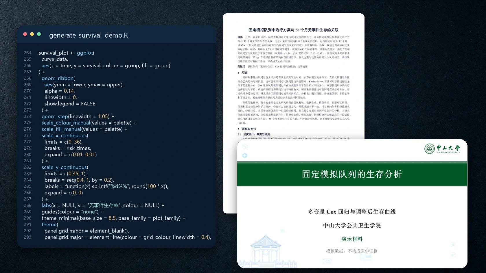
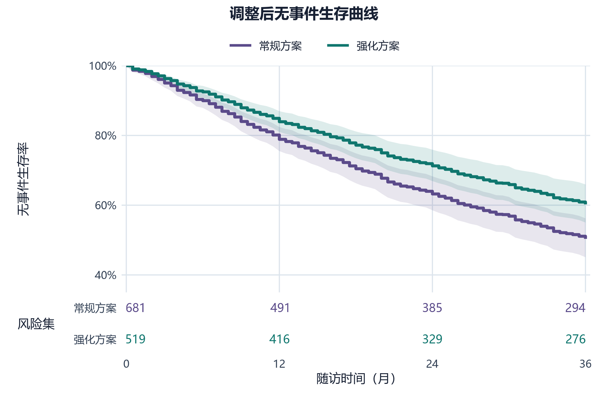
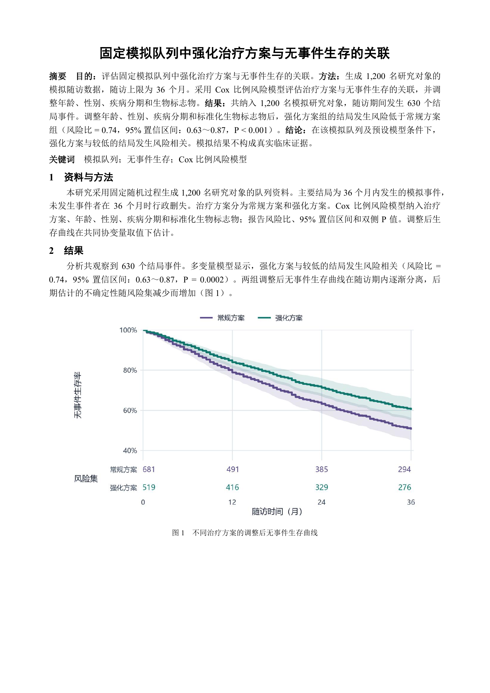
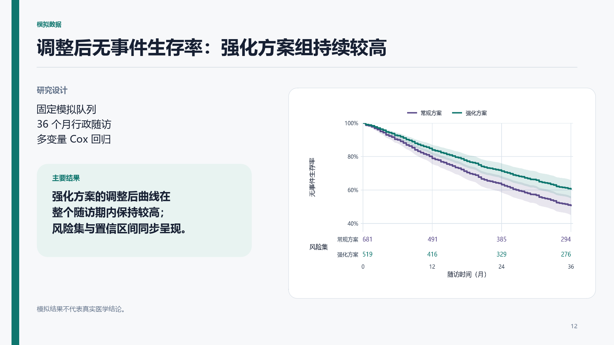

<div align="center">

# EpiAgentKit

**把流行病学与卫生统计任务，变成快慢自适应、可执行、可复核、可发表或交付的工作流。**

Shared research workflow kit for Claude Code and Codex, built for epidemiology and biostatistics.

[](https://code.claude.com/docs)
[](https://openai.com/codex/)


[30 秒安装](#30-秒安装) · [项目能做什么](#项目能做到什么) · [实际示例](#从一句话到真实产物) · [任务范围](#工作流怎样随任务变化) · [双平台架构](#它如何工作) · [安全边界](#安全边界) · [维护指南](#维护与贡献)

</div>



> EpiAgentKit 不是新的统计软件，也不是一组万能提示词。它是一套面向科研 Agent 的规则、技能、工具和确定性检查，让研究者能够在同一套约束下组织项目、运行分析、制作成果并完成审查。

| 按任务增加必要步骤 | 结果可追溯 | 双平台一致 |
| --- | --- | --- |
| 问答、局部修改和快速尝试立即执行，只在进入主分析或发布时增加必要检查 | 关键结果由生成脚本写入结果清单，并关联输入、分析集、运行编号和实际使用结果的文件 | Claude Code 与 Codex 从同一仓库安装、同步并接受相同检查 |

## 项目能做到什么

只需要描述当前任务，EpiAgentKit 会按任务类型加载必要 skill，并形成可检查的文件、代码或交付物。

统计分析以 R 为主要和默认路径，标准研究工作流不要求用户具备 Python 环境。任务所需运行时缺失时先做只读检查，说明用途、安装范围和风险并询问是否安装；用户不安装时优先使用现有语言中的经核验等价实现，以相同输入、方法口径和验收标准核对。不存在等价实现时明确差异，不把近似替代说成相同效果。

| 研究任务 | 它会做什么 | 典型产物 |
| --- | --- | --- |
| 新建研究项目 | 在 `analysis`、`paper`、`consulting`、`teaching` 和 `oneoff` 五种项目类型中选择当前任务所需的最小结构 | 可直接开始工作且没有多余空目录的项目基本结构 |
| 核验文献与方法依据 | 核对题名、作者、DOI/PMID、来源身份和撤稿状态，必要时组织正式证据检索 | 核验记录、证据核对表、方法选择依据 |
| 完善研究设计与 SAP | 把研究想法转成 PICO/PECO、estimand、终点、时间零点、偏倚控制、样本量或精度依据及预设分析 | 可审查的 PROTOCOL、SAP、未决事项与设计备忘录 |
| 完成 R 统计分析 | 执行数据清洗、描述统计、回归、生存分析、中介分析与 Meta 分析；从项目根运行总脚本，并自动保存命令、状态、日志和环境信息 | 可复现 R 脚本、结果对象、必要表图与自动运行记录 |
| 完成明确选择的 Python 统计分析 | 在用户指定 Python 或既有 Python 项目中执行数据清洗、描述统计、回归、生存分析、预测验证与异常核查，并与 R 共用结果数字唯一来源 | 可复现 Python 脚本、结果对象、表图与方法记录 |
| 制作发表级统计图 | 按真实数据和最终物理尺寸生成森林图、生存曲线、ROC、热图、回归诊断等结果图 | PDF、PNG 或 SVG 图件及对应出图代码 |
| 生成科研非统计视觉 | 为论文、PPT、标书、报告、README 和技术文档生成流程、路线、框架、机制与图形摘要，并区分内容图、真实截图和氛围图 | 经来源、结构、文字和嵌入后显示复核的完整图件 |
| 写论文与投稿材料 | 基于项目已有结果起草中英文论文部件、学位论文、Cover Letter、Highlights 和审稿回复，并执行证据约束审校 | Markdown 或 Word 稿件、投稿材料与自检记录 |
| 评审论文与生成审稿报告 | 以同行评审人身份核对稿件中的数据与论断是否对应，并审查设计、偏倚、统计、解释、报告规范、语言和伦理，区分报告缺项与方法错误 | 可定位、分 major/minor、说明未核验内容的完整 reviewer report |
| 写报告与制作学术汇报 | 把分析结果转成面向读者的报告，或基于中山大学模板生成组会、开题、答辩与正式汇报 | 报告正文、DOCX、可直接汇报的 PPTX |
| 打包统计咨询结果 | 按数据授权、交付目的和收件人可用软件整理最小外发包，中间格式、编号和报告长度由实际用途决定 | 交付内容清单、必要代码与结果、总运行脚本 |
| 全项目质量审查 | 区分日常受影响部分检查与正式发布检查，核对数据、代码、结果、表图、正文，以及伦理、合规、隐私和结果追溯记录 | 通过、有明确限制地通过或不通过，并列出证据位置和处理建议 |
| 处理常见科研文件 | 在内容主流程之外读取、编辑、验证和转换 Word、PowerPoint、Excel 与 PDF | `.docx`、`.pptx`、`.xlsx`、`.pdf` 等实际文件 |

### 你可以直接这样提需求

```text
在这个现有队列项目中完成 Cox 回归和森林图，并核对全部 warning。

快速核验这条 DOI 的题名、作者与撤稿状态，不做系统综述。

根据 results/results.yaml 起草结果与讨论，生成 Word 稿，并检查数字一致性。

以期刊审稿人身份审查这篇论文的数据、方法、统计、论断和语言，生成完整审稿报告。

全面审查这个项目的命名、代码、结果、论文和交付包是否一致。
```

## 从一句话到真实产物

以下四类示例分别展示统计图、论文页面、汇报页面和 AI 工作流程。统计结果来自固定模拟队列的实际 R 分析；论文预览来自可打开的 Word 文档；PPT 页面是中性 16:9 版式模拟图。所有示例只用于核对工作流和成品质量，不代表真实医学结论。

### 统计图

```text
使用固定模拟队列完成多变量 Cox 回归，分别导出带 95% 置信区间和风险集的调整后生存曲线；
论文图不写副标题、样本摘要或模型指标横幅，标题和图例相对整张导出画布居中，并按最终物理尺寸核对字号。
```

<picture>
  <source media="(max-width: 600px)" srcset="docs/demo/output/adjusted-survival-mobile.png">
  
</picture>

`biostat-principles → publication-figures` 负责分析口径、数值验证、最终尺寸、标题与图例对齐和中文字体。[查看 PDF](docs/demo/output/adjusted-survival.pdf) · [查看分析与出图脚本](docs/demo/generate_survival_demo.R) · [查看模拟数据](docs/demo/survival-demo-data.csv) · [查看机器可读结果](docs/demo/output/survival-demo-results.csv)

### 论文效果



该页面由实际 `.docx` 渲染，题名居中，正文采用中性中文论文格式；模型口径写在方法，结果解释写在结果，图下只保留简短图题。页面不使用虚构作者、机构、期刊、DOI、伦理号或基金信息。[下载 Word 示例](docs/demo/output/manuscript-preview.docx) · [查看生成脚本](docs/demo/generate_manuscript_preview.py)

### PPT 效果



汇报页使用 16:9 画布，页标题、研究设计和结论由幻灯片版式承担，统计图保持论文式原图，不把 PPT 的信息层级烧录进图件。[查看版式生成脚本](docs/demo/generate_presentation_preview.R)

### AI 工作流程


同一套全局规则连接问题定义、证据核验、统计分析、图表制作、论文与汇报、结果交付和项目审查；领域 skill 只在任务需要时加载，确定性检查负责保护原始数据、结果来源和发布条件。

## 工作流怎样随任务变化

Claude Code 与 Codex 共用同一套全局规则。系统先根据用户要求和现有工作区确定本轮范围，领域技能只完成这个范围内的工作；自动检查用于保护原始数据、结果来源、敏感信息和正式发布要求。简单问题不会因为调用某个技能而变成完整项目，正式投稿或外发也不会省略必要核验。

| 范围 | 何时使用 | 记录与验证 |
| --- | --- | --- |
| Q 问答 | 解释、判断、只读核验 | 直接回答，不创建项目文件 |
| L 局部产物 | 单文件、单部件、单项格式或快速结果 | 只验证本次修改及其直接影响，不补建记录文件 |
| P 项目执行 | 改变数据、代码、方法或正式结果 | 同步实际生成结果的分析脚本、`results/results.yaml`、使用这些结果的文件和自动运行记录 |
| R 正式发布 | 投稿、外发、归档或全面质控 | 运行正式发布检查，ERROR 阻止发布，可接受限制须明确说明 |

| 阶段 | EpiAgentKit 的检查要求 |
| --- | --- |
| 问题定义 | 先确认 PICO/PECO、estimand、时间零点、分组、终点、纳排标准、分析集与主要分析口径 |
| 证据核验 | 核验来源身份，区分已核验事实、合理推断和待补证据 |
| 统计分析 | 代码必须实跑，输出必须存在，异常必须全量扫描并逐项归因 |
| 图表制作 | 统计数据图、非统计视觉和原始科研证据按属性分流，图件放入实际论文、PPT、报告或网页后复核 |
| 论文与汇报 | 统计数字来自机器可读的唯一来源，论文、报告、PPT 和图表不手敲关键结果 |
| 结果交付 | 交付包服从数据授权和接收方环境；包含或引用输入均可，但必须可追溯 |
| 项目审查 | 科学、合规、隐私、追溯或复现 ERROR 阻止发布；结构偏好通常为 WARN/INFO |

## 它如何工作

EpiAgentKit 把 Agent 的行为分成四层，仓库是 Claude Code 与 Codex 的共同配置源。


| 层 | 组件 | 作用 |
| --- | --- | --- |
| 全局规则 | [`CLAUDE.md`](CLAUDE.md) | 每个会话必须遵守的安全要求、任务分流、唯一来源说明与完成条件 |
| 领域技能 | [`skills/`](skills/) | 按需加载分析、证据、写作、视觉、交付与审查流程，避免把所有规范塞进上下文 |
| 确定性 hooks | [`hooks/`](hooks/) | 保护原始数据，检查 R 语法、文本痕迹、图件与结果文件 |
| 配置管理器 | [`scripts/epiagentkit.py`](scripts/epiagentkit.py) | 安装、同步、冲突清理、双端一致性验收与项目终检 |

### 四类任务范围

| 范围 | 什么时候使用 | 系统行为 |
| --- | --- | --- |
| Q 问答 | 解释、判断、只读核验 | 只回复，不创建文件 |
| L 局部产物 | 单个已经确认的产物或快速尝试 | 直接执行，只检查实际受影响的内容 |
| P 项目执行 | 改变正式分析过程 | 通过总运行脚本执行，更新 `results/results.yaml`、方法决定和自动运行记录 |
| R 正式发布 | 投稿、外发、归档或全面质控 | 增加期刊要求、授权、隐私、交付和正式发布检查 |

触发某个领域 skill 不会自动扩大范围。E0 快速核验通常不建实验目录；E1 在一个独立工作目录中写清比较前提、实际运行和结论，记录可以合并也可以分开；只有 E2 正式比较才建立全项目的比较记录，并保留所有方案的结果。

正式项目把可恢复旧版与临时工作彻底分开：

```text
09_backup/
├── archive/     被当前版替代且需要恢复的正式文件
└── workbench/   实验、诊断、复现和一次性脚本
```

`09_backup/INDEX.md` 只索引 `archive/`；项目 `EXPERIMENTS.md` 只在 E2 出现时索引 `workbench/` 中的正式比较。新项目不再把批次直接写到 `09_backup/` 根，旧项目的根级历史批次仍可读取。

## 30 秒安装

最简单的方法是把仓库地址交给当前使用的 Agent，让它完成检查、安装、备份和验收；不需要先手动克隆仓库、复制规则或逐个放置 skills。

### 在 Claude Code 中

```text
请把 EpiAgentKit 安装到当前 Claude Code：https://github.com/KangWang42/EpiAgentKit。保留我现有的个人配置，安装完成后检查是否可用。
```

### 在 Codex 中

```text
请把 EpiAgentKit 安装到当前 Codex：https://github.com/KangWang42/EpiAgentKit。保留我现有的个人配置，安装完成后检查是否可用。
```

需要同时配置两端时，把“当前 Claude Code / Codex”改为“Claude Code 与 Codex”。获取仓库、选择安装目标、备份、同步和检查由 Agent 按仓库说明完成。用户不需要先处理 Git、Python、目录或复制命令。

### release 1.1

只需要规则和 17 个可分发 skills 时，可以把 [EpiAgentKit 1.1 release](https://github.com/KangWang42/EpiAgentKit/releases/tag/v1.1) 直接交给当前 Agent：

```text
请把这个 EpiAgentKit release 安装到我当前使用的 Agent：https://github.com/KangWang42/EpiAgentKit/releases/tag/v1.1。保留我现有的个人配置，安装完成后检查 skills 是否可用。
```

release 使用普通版本目录解压，不直接作为 `~/.claude`、`~/.codex` 或 `~/.agents`。完整的 Agent 安装要求、人工备用命令、更新和回退方法见 [release 1.1 使用说明](docs/release-1.1-usage.md)，排除范围与外部依赖见 [许可说明](docs/release-notice.md)。轻量 release 不分发 `docx`、`pdf`、`pptx`、`xlsx`、机构模板和 imagegen 系统能力。

<details>
<summary><strong>只在明确需要自己操作时查看命令行方式</strong></summary>

配置管理器会保留已有个人配置，只更新同名 EpiAgentKit 文件与受管 hook，并在安装结束后自动运行 `doctor`。

```bash
git clone https://github.com/KangWang42/EpiAgentKit.git
cd EpiAgentKit
python scripts/epiagentkit.py install
```

```bash
# Claude Code 与 Codex 完整安装
python scripts/epiagentkit.py install --target all --preset full --yes

# 只安装统计分析技能包
python scripts/epiagentkit.py install --target all --preset analysis --yes

# 只安装论文与报告技能包
python scripts/epiagentkit.py install --target all --preset writing --yes

# 只为 Codex 安装 PPT 与科研视觉技能包
python scripts/epiagentkit.py install --target codex --preset ppt --yes

# 先演练，不修改用户目录
python scripts/epiagentkit.py install --target all --preset full --yes --dry-run
```

```bash
# 从仓库同步已安装内容，并复核 Claude Code 与 Codex 一致性
python scripts/epiagentkit.py sync --target all
python scripts/epiagentkit.py doctor --target all

# 查看预设与可分发技能
python scripts/epiagentkit.py list

# 自选技能，依赖项自动补齐
python scripts/epiagentkit.py install --target all --preset custom \
  --skills sysu-ppt,report-writing --with-rules --yes

# 对正式研究项目运行项目最终检查
python scripts/epiagentkit.py check-project <项目根>
```

Codex 默认把自定义 skills 安装到官方目录 `~/.agents/skills/`。`--codex-layout codex` 与 `both` 仅用于兼容旧布局，并会提示重复技能风险。

</details>

## 功能与技能

| 类型 | Skills |
| --- | --- |
| 原则、证据与设计 | `biostat-principles` · `evidence-research` · `epi-study-design` |
| 项目与分析 | `project-init` · `r-biostats` · `python-biostats` · `publication-figures` |
| 科研视觉 | `research-visuals` · `svg-diagrams` |
| 论文与报告 | `academic-publishing` · `academic-humanizer` · `report-writing` |
| 汇报与交付 | `sysu-ppt` · `consulting-delivery` |
| 项目审查 | `epi-project-audit` |
| 文件与维护 | `docx` · `pdf` · `pptx` · `xlsx` · `epiagentkit-maintenance` · `skill-creator` · `git-commit-helper` |

先选择完成任务所需的内容工作流，再添加必要的图件或文件操作，最后进行相应检查。研究设计使用 `biostat-principles → epi-study-design`；统计分析默认转 `r-biostats`，仅在用户明确选择或既有 Python 项目中转 `python-biostats`，实际出统计图时再加 `publication-figures`；论文从零生成使用 `academic-publishing → academic-humanizer`，需要 Word 时再加 `docx`；非统计视觉统一使用 `research-visuals → imagegen`，只有符合该技能列明的条件时才改用 `svg-diagrams`。

## 为什么不只是一个提示词仓库

- **原始数据只读**：`01_data/rawdata/` 与项目声明的其它原始根不得被 Agent 修改。
- **口径先于模型**：分组、终点、纳排和主分析存在多个合理定义时，必须先澄清。
- **生成脚本写结果清单**：新正式项目以 `results/results.yaml` 保存数值、显示格式和来源；解释与结论不混入结果清单，旧路径只读兼容。
- **代码必须实跑**：不以退出码或日志尾部代替核验，必须全量扫描 `error|warning|traceback|failed|nan`。
- **按本轮范围控制工作量**：Q/L 立即执行且不补写历史记录；P 只同步受影响部分；明确投稿、外发或全面审查才运行正式发布检查。
- **探索按影响分级**：E0 不创建记录文件，E1 保存单批次证据，E2 才维护正式比较索引；满足预设条件并经必要确认后才进入主流程。
- **目录按类别管理**：`.epiagentkit-layout.json` 只声明活动目录与产物类别；类别内文件由生成脚本、表图登记表或交付内容清单管理，不逐文件登记。
- **运行情况自动记录**：`run_pipeline.R|py` 把命令、时间、运行状态、脚本、输入输出文件哈希值和环境信息写入 `results/runs/<run_id>.json`，同时保留完整日志，不要求人工填写 `SESSION_LOG.md`。
- **中文以读者能直接理解为准**：逐句写清科研动作、证据、条件和确认责任；词面扫描只发现线索，不用软件内部简写替代科研表达。
- **当前版保持唯一**：含义明确且长期不变的文件名只保留一组当前交付物；被替代的正式文件进入 `09_backup/archive/`，试验与一次性工作进入 `09_backup/workbench/`，两类索引不混用。
- **修订范围可以逐项核对**：已有论文和 Word 稿先确认唯一输入、用户纠正、允许修改和不得改动的内容；只有正式的多轮修订或需要多个交付文件时，才建立 `revision-state.json`，并由同一组修改记录生成净稿、标注稿和审稿回复。
- **双平台共用正文**：Claude Code 和 Codex 读取同一份规则与技能，不维护两套容易漂移的内容。

## 安全边界

| EpiAgentKit 会做 | EpiAgentKit 不会做 |
| --- | --- |
| 依据项目文件、真实分析结果和可核验来源推进任务 | 编造研究发现、文献、DOI/PMID、伦理号、基金号或期刊要求 |
| 在授权范围内整理非原始文件、运行代码、生成成果并审查 | 修改原始数据，或在数据异常未解决时擅自填补、排除和继续计算 |
| 把观察性结果校准为合适的论断强度 | 把关联写成已证实因果，或把探索性峰值包装成最终结论 |
| 自动完成可确定的执行、核验、同步和常规判断 | 在证据不足时编造研究问题、终点、分析集、异常处置、署名或必须由责任人确认的科学决定 |

正式归档只处理已经确认的非原始文件：先用 dry-run 列出将要移动的文件，再移动到 `09_backup/archive/` 中不会覆盖旧批次的位置，同时生成 `MANIFEST.json`（文件及其哈希值清单）和 `INDEX.md`（正式归档索引）。来源、当前版本或引用关系不清时停止并请用户决定。Git 可用时可额外保留恢复历史；没有 Git 时工作流会跳过 Git，不会代为安装。项目约定来自作者的研究与咨询实践，不是领域唯一标准，可按团队规范删改。

## 维护与贡献

### 用 Codex 快速完善 skills

从本仓库根目录启动 Codex，把实际失败、正确示例、必须保留的旧行为和希望改变的结果一起给出。Codex 官方支持用 `$skill-creator` 显式选择 skill 创建与更新流程；长期仓库规范放在 `AGENTS.md`，任务流程放在各 skill 的 `SKILL.md`、`references/` 和 `scripts/` 中。可直接发送：

```text
$skill-creator
只修改当前 EpiAgentKit 仓库。先完整读取 AGENTS.md、CLAUDE.md，并使用 epiagentkit-maintenance 与 skill-creator。

实际问题：<粘贴失败现象、文件位置或错误输出>
正确结果：<说明希望得到什么，最好附一个可靠示例>
必须保留：<列出不能被这次修改破坏的旧行为>

请先复现并找到最早失效的工作流步骤，再确定保留、重写、合并、移动、脚本化或删除哪些内容。修改适用的规则、skill、reference、模板、调用者和回归测试，不要只追加同义提醒或只替换点名词语。完成后运行目标组件验证、完整单元测试、audit_workflow_contracts.py、sync 和 doctor；审查完整差异后按 Conventional Commits 提交。不要 push，除非我本轮明确要求。
```

修改后若当前会话仍使用已经加载的旧 skill 内容，先运行 `python scripts/epiagentkit.py sync --target all`，再新开 Codex 会话验证。Codex 关于 [`AGENTS.md`](https://learn.chatgpt.com/docs/agent-configuration/agents-md) 与 [skills](https://learn.chatgpt.com/docs/build-skills) 的当前说明以官方文档为准。

维护本仓库时先使用 `epiagentkit-maintenance`。优化不是只增不减：先确认要保留的旧行为，再决定哪些内容重写、合并、移到专门的 reference 或脚本、删除或新增，并用新旧代表性场景共同验证。修改规则、skills、hooks 或安装器后，至少运行：

```bash
python scripts/audit_skill_contracts.py
python scripts/audit_workflow_contracts.py
python -m unittest discover -s scripts/tests -p "test_*.py"
python scripts/epiagentkit.py sync --target all
python scripts/epiagentkit.py doctor --target all
```

维护者需要重新生成轻量包时运行 `python scripts/build_release.py`。构建器只接受固定白名单，遇到未提交修改或既有目标时停止；完成许可核对后才分别使用 `--allow-dirty` 或 `--force`。默认输出 `releases/1.1/EpiAgentKit-release-1.1.zip` 及外部 SHA-256 文件。

行为发生变化时，还需要对受影响的 R、Python 或 Bash 脚本做语法检查和代表性实跑。详细 contributor 约定见 [`AGENTS.md`](AGENTS.md)，全局规则迁移说明见 [`docs/global-rule-migration.md`](docs/global-rule-migration.md)。

<details>
<summary><strong>参考来源与许可证说明</strong></summary>

Skill 分流与维护规范参考了 GitHub [awesome-copilot skills 固定提交 `dae77f2`](https://github.com/github/awesome-copilot/tree/dae77f24132c1d686c30fd5b29aee0d63668d1d2/skills) 中的最小兼容 skill 栈、输入—操作—输出匹配、可观察成功条件、基线验证和渐进披露模式。EpiAgentKit 只吸收这些通用设计原则，不复制其长篇通用 playbook、破坏性 Git 操作或与流行病学证据链冲突的固定流程。

`research-visuals` 借鉴并重新实现了 [TingxiYu/academic-figure-skill](https://github.com/TingxiYu/academic-figure-skill) 与 [LigphiDonk/academic-figure-generator](https://github.com/LigphiDonk/academic-figure-generator) 中围绕研究问题进行图前说明、逐项核对资料来源和多轮检查图件质量的方法。仓库只归档选定的开源参考文档与提示词，没有引入其正式运行脚本、示例图片或第三方 API 配置。完整来源、固定快照、许可证与 SHA-256 见 [`external/SOURCE.md`](skills/research-visuals/references/external/SOURCE.md)。

`docx`、`pdf`、`pptx`、`xlsx` 与 `skill-creator` 来自 [anthropics/skills](https://github.com/anthropics/skills)，各目录保留原始 LICENSE。`sysu-ppt` 内置模板版权归中山大学所有，仅供学习参考，可删除模板后替换为自有资产。

</details>

---

<div align="center">

如果你希望科研 Agent 不只“给答案”，而是留下可运行、可复核、可交付的完整证据链，EpiAgentKit 就是为此设计的。

</div>
