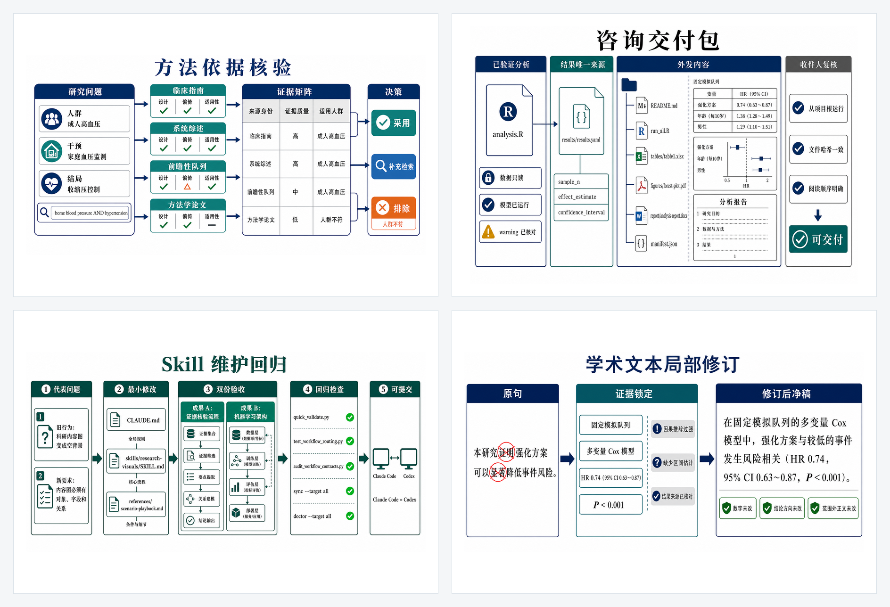
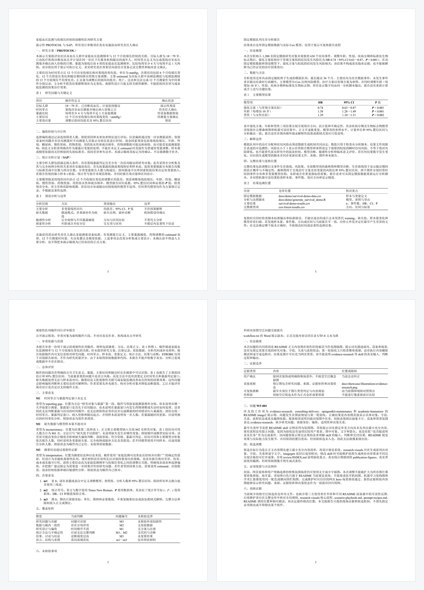

# 从命令到输出

本页集中列出 README 中各 skill 的可执行入口、具体内容图、真实文档和机器可读结果。固定模拟结果只用于验证工作流；没有可核验输入时不生成研究发现。

## 具体任务内容图

[方法依据核验](illustrations/evidence-research.png) · [咨询交付包](illustrations/consulting-delivery.png) · [Skill 维护回归](illustrations/epiagentkit-maintenance.png) · [学术文本局部修订](illustrations/academic-humanizer.png)

## 实际文档

[研究方案与 SAP DOCX](../demo/output/document-skills/epi-study-design/home-bp-monitoring-protocol-sap.docx) · [分析报告 DOCX](../demo/output/document-skills/report-writing/fixed-cohort-survival-report.docx) · [复现核查备忘录 DOCX](../demo/output/document-skills/report-writing/fixed-cohort-reproducibility-memo.docx) · [同行评审 DOCX](../demo/output/document-skills/manuscript-peer-review/cohort-manuscript-review-report.docx) · [workflow.txt](../demo/output/document-skills/workflow-retrospective/workflow.txt)

## 完整索引

| Skill | 命令或请求示例 | 当前可查看输出 |
| --- | --- | --- |
| `biostat-principles` → `r-biostats` | `Rscript docs/demo/generate_survival_demo.R` | [模拟数据](../demo/survival-demo-data.csv)、[结果清单](../demo/output/publication-figures/survival-demo-results.csv) |
| `evidence-research` | 核验一条 DOI、方法依据或最新指南 | [具体任务图](illustrations/evidence-research.png) · [证据矩阵规范](../../skills/evidence-research/references/evidence-matrix.md) |
| `epi-study-design` | 把研究想法转成 PROTOCOL / SAP | [DOCX](../demo/output/document-skills/epi-study-design/home-bp-monitoring-protocol-sap.docx) · [PDF](../demo/output/document-skills/epi-study-design/home-bp-monitoring-protocol-sap.pdf) |
| `python-biostats` | 明确指定 Python 后执行同一研究口径 | [Python 执行边界](../../skills/python-biostats/SKILL.md)；本仓库不把 R 结果冒充 Python 示例 |
| `academic-humanizer` | 修订已有论文、报告或投稿文本 | [局部修订实例图](illustrations/academic-humanizer.png) · [中文稿 Word](../demo/output/academic-publishing/manuscript-preview-zh.docx) |
| `report-writing` | 把已核验结果整理成报告正文 | [分析报告 DOCX](../demo/output/document-skills/report-writing/fixed-cohort-survival-report.docx) · [复现核查备忘录 DOCX](../demo/output/document-skills/report-writing/fixed-cohort-reproducibility-memo.docx) |
| `consulting-delivery` | 把已完成分析整理为外发交付包 | [具体交付图](illustrations/consulting-delivery.png) · [咨询项目结构示例](project-init/consulting.md) |
| `manuscript-peer-review` | 以同行评审人身份生成可定位审稿报告 | [DOCX](../demo/output/document-skills/manuscript-peer-review/cohort-manuscript-review-report.docx) · [PDF](../demo/output/document-skills/manuscript-peer-review/cohort-manuscript-review-report.pdf) |
| `epi-project-audit` | `python <skill>/scripts/run_check_project.py <项目根> --json` | [审查清单](../../skills/epi-project-audit/references/audit-checklist.md) · [论断校准](../../skills/epi-project-audit/references/claim-calibration.md) |
| `docx` / `pdf` | 打开、渲染、验证或转换实际文件 | [Word](../demo/output/academic-publishing/manuscript-preview-zh.docx) · [PDF](../demo/output/academic-publishing/manuscript-preview-zh.pdf) |
| `xlsx` | 读取、清洗、创建或核验工作簿 | [工作簿操作规范](../../skills/xlsx/SKILL.md)；需绑定用户数据后生成，不放虚构表格 |
| `workflow-retrospective` | 根据会话纠正生成 `workflow.txt` | [workflow.txt](../demo/output/document-skills/workflow-retrospective/workflow.txt) · [展示 DOCX](../demo/output/document-skills/workflow-retrospective/workflow-retrospective-display.docx) |
| `epiagentkit-maintenance` / `skill-creator` | 修改 skill、规则或同步规范 | [具体维护图](illustrations/epiagentkit-maintenance.png) · [维护约定](../../AGENTS.md#skill-maintenance) |
| `git-commit-helper` | 审查完整差异并创建 Conventional Commit | [提交历史](https://github.com/KangWang42/EpiAgentKit/commits/main) |
